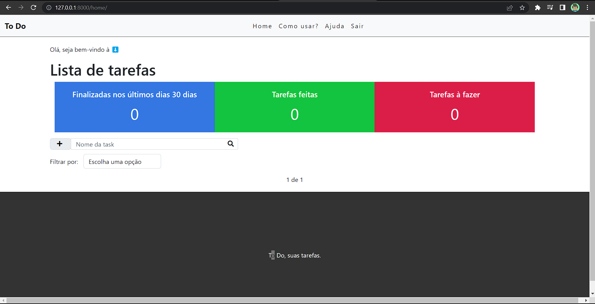

<h1>Django, projecto To Do.</h1>

Este é um site simples, sem hospedagem, mas que serve muito bem para usar diariamente.

O site possui as seguintes características:
<ul>
    <li>Login/Logout</li>
    <li>Filtrar tarefas</li>
    <li>Dashboard</li>
    <li>Sistema de pesquisa</li>
    <li>Adição de tarefas</li>
    <li>Edição de tarefas</li>
    <li>Remoção de tarefas</li>
    <li>Paginação</li>
</ul>

Visual do site: 

&nbsp;

Se gostar, me siga e me ajude a me tornar um grande desenvolvedor.

